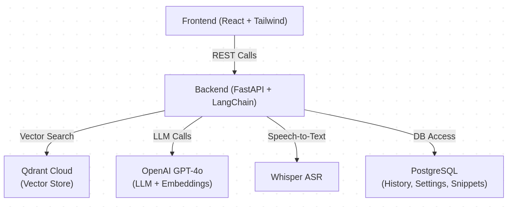

🚀 Smart Developer Assistant (SDA)

AI-powered development assistant with RAG, multi-modal input, code analysis, project understanding, and conversational chat.
Built with FastAPI, React, LangChain 1.x, Qdrant Cloud, OpenAI GPT-4o models, and Whisper Speech-to-Text.

🧠 Overview

Smart Developer Assistant (SDA) is a modular, full-stack AI system designed to boost developer productivity.
It supports:

- Intelligent chat with memory.
- Document & project RAG search
- Code review and debugging
- Project ZIP ingestion & analysis
- Speech-to-text via Whisper
- User history, settings, and code snippet storage
- SDA is implemented using industry-grade GenAI patterns, following - guidance from IBM’s Agentic AI and Machine Learning Engineer certification tracks.


✨ Core Features (Phase 1–5)
🔹 Phase 1 – Basic Chat & History
- Simple conversational AI using OpenAI GPT models
- Stores request history in PostgreSQL
- Frontend chat UI built with React + Tailwind

🔹 Phase 2 – RAG Search Across Uploaded Docs
- Users upload PDFs/Markdown
- Documents embedded via OpenAI embeddings
- Stored in Qdrant Cloud collection: project_docs
- Query handled via hybrid retrieval (vector + ranking)

🔹 Phase 3 – Code Upload & Analysis
- Upload ZIP project
- Extract, chunk, embed code files
- Create per-project Qdrant collections
- LLM-powered project overview generation

🔹 Phase 4 – Speech Input
- Microphone recording in frontend
- Whisper model converts audio → text
- Text fed directly into the chat endpoint

🔹 Phase 5 – Conversational Chat + Persistent State
- Multi-turn chat with history (stored in PostgreSQL)
- Qdrant Cloud + LangChain 1.x Runnable pipelines
- Code review endpoint

User settings & favorite snippets

🚀 Future (Phase 6)
- Agentic multi-tool workflows
- Deployment on GCP/AWS
- Model caching & batching
- Worker queue (Celery/RQ)

🏗️ System Architecture
High-Level Architecture

Backend Components

FastAPI app under /backend/app

Routers:

- /api/v1/generate
- /api/v1/answer_from_docs
- /api/v1/upload_project
- /api/v1/analyze_project
- /api/v1/review_code
- /api/chat
- /api/v1/transcribe_audio

Uses LangChain Core, LangChain Qdrant, Runnable components

Frontend Components

Located in frontend/src/:

- App.tsx – layout
- lib/api.ts – API client
- components/* – chat, analyzers, uploaders
- Tailwind styling


📦 Project Structure
```
sda/
├── backend/
│   ├── app/
│   │   ├── api/
│   │   │   ├── chat.py
│   │   │   ├── snippets.py
│   │   │   ├── settings.py
│   │   ├── ai_service.py
│   │   ├── project_ingest.py
│   │   ├── database.py
│   │   ├── init_db.py
│   │   └── main.py
│   ├── ingest.py
│   ├── phase5_ingest.py
│   ├── pyproject.toml
│   └── ...
├── frontend/
│   ├── src/
│   ├── package.json
│   └── ...
└── README.md

```

🗄️ Data Storage
PostgreSQL (Structured)

- request_history
- chat_history
- user_settings
- user_snippets
- project_collections

### Qdrant Cloud (Vector)

Collections:

- project_docs
- project_{user}_{timestamp} for project uploads

Embeddings:

- text-embedding-3-small (1536 dimensions)

🔊 Speech-to-Text (Whisper)

Frontend:

- Mic recording
- Sends .webm → /api/v1/transcribe_audio

Backend:

- openai-whisper to transcribe
- Mapped to chat text input

⚙️ Installation
Prerequisites

- Python 3.12+
- Node.js 20+
- PostgreSQL running locally
- Qdrant Cloud account (Free Tier OK)

Backend Setup
```
cd backend
uv venv .venv
source .venv/bin/activate
uv pip install -r requirements.txt

```

Run backend:
```
uvicorn app.main:app --reload
```
Frontend Setup
```
cd frontend
npm install
npm run dev

```

🧬 Environment Variables

Create /backend/.env:
```
OPENAI_API_KEY=your_key
QDRANT_URL=https://YOUR.qdrant.cloud
QDRANT_API_KEY=your_qdrant_key

DB_HOST=localhost
DB_NAME=sda_dev_db
DB_USER=postgres
DB_PASSWORD=yourpassword

```
🔌 Key Endpoints
| Endpoint                   | Purpose                      |
| -------------------------- | ---------------------------- |
| `/api/chat`                | Phase-5 conversational agent |
| `/api/v1/generate`         | General AI generation        |
| `/api/v1/answer_from_docs` | RAG Docs Q&A                 |
| `/api/v1/upload_project`   | ZIP ingestion                |
| `/api/v1/analyze_project`  | Project architecture summary |
| `/api/v1/review_code`      | LLM-powered code review      |
| `/api/v1/transcribe_audio` | Speech-to-text               |

🧠 Technology Stack
Backend

- FastAPI
- LangChain Core 1.x
- LangChain Qdrant
- Qdrant Cloud
- PostgreSQL
- Whisper ASR
- OpenAI GPT-4o

Frontend

- React + Vite
- TailwindCSS
- Redux state
- Axios


## 🙏 Acknowledgements

This project uses the following open-source libraries and frameworks:

- [LangChain](https://github.com/langchain-ai/langchain) — MIT License  
- [Qdrant](https://github.com/qdrant/qdrant) — Apache 2.0 License  
- [React](https://github.com/facebook/react) — MIT License  
- [Node.js](https://github.com/nodejs/node) — MIT License  
- [FastAPI](https://github.com/tiangolo/fastapi) — MIT License  
- [PostgreSQL](https://www.postgresql.org/) — PostgreSQL License  
- [Sentence Transformers](https://github.com/UKPLab/sentence-transformers) — Apache 2.0 License  

We gratefully acknowledge the work of these communities.

> ℹ️ **Note on licenses:**  
> - MIT (used by LangChain, React, Node.js, FastAPI) is permissive — you can reuse the code freely as long as you credit the author.  
> - Apache 2.0 (used by Qdrant, Sentence Transformers) provides similar freedoms with added patent protection.  
> - PostgreSQL License allows unrestricted use and modification for both open and closed source projects.

---

## 📌 Notice

Please see the [NOTICE.md](./NOTICE.md) file for attribution and detailed acknowledgements.

**Copyright © 2025 Santosh Narayanan**