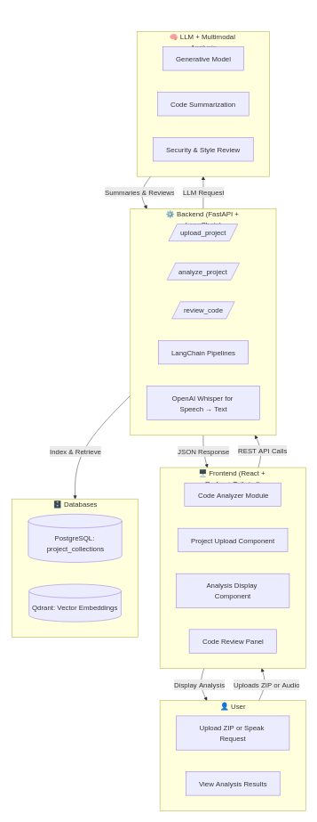
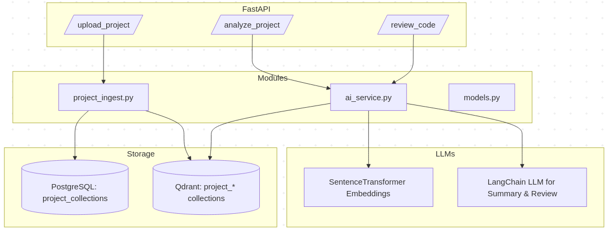
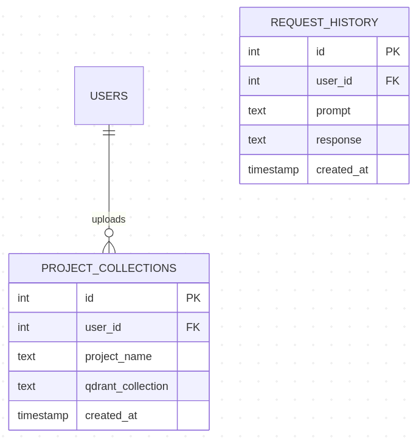
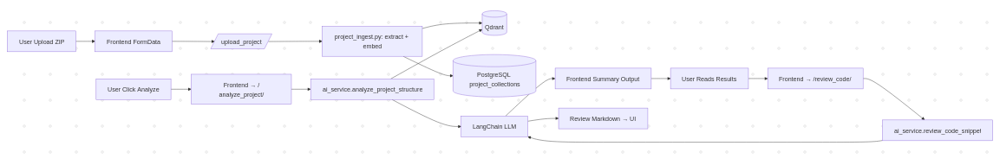
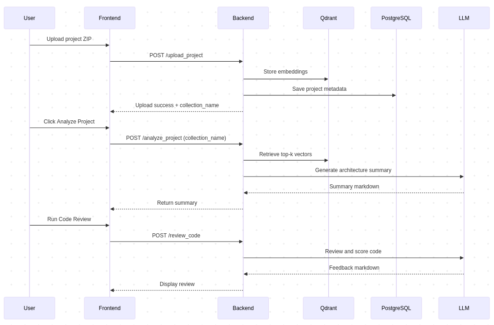

# 📘 Technical Design — Smart Developer Assistant (SDA)
## Phase 4: Multimodal + Project Analyzer Integration

---

## 1️⃣ Introduction

This document outlines the technical design and implementation details for **Phase 4** of the **Smart Developer Assistant (SDA)** — aligning with the IBM course  
**“Build Multimodal Generative AI Applications.”**

The goal of this phase is to extend SDA beyond simple prompt-based or RAG-based responses to perform **project-level codebase analysis**, **architectural summarization**, and **code reviews** using multimodal input (text, code, and optional images).

---

## 2️⃣ System Overview

SDA now supports **multimodal project ingestion** and **intelligent code analysis**.

### 🏗️ Updated System Architecture


#### Key Components:
- **Frontend (React + Redux + Tailwind)**
  - Adds new **Code Analyzer** module.
  - Supports file uploads, progress feedback, and markdown-style summaries.
- **Backend (FastAPI + LangChain + Qdrant)**
  - Handles project ZIP uploads, embedding ingestion, and retrieval-based analysis.
- **Databases**
  - **Qdrant**: Stores vector embeddings for each uploaded project.
  - **PostgreSQL**: Tracks `project_collections` metadata (project ↔ user).
- **LLM Integration**
  - Generates summaries, reviews, and refactoring suggestions using LangChain pipelines.

---

## 3️⃣ Backend Implementation

### 🔹 New Files and Endpoints

#### 📄 `project_ingest.py`
Handles unzipping, parsing, embedding, and indexing of uploaded project ZIPs.

#### 📄 `ai_service.py`
Added two new analysis methods:
- `analyze_project_structure()`: Creates architecture summaries from Qdrant context.
- `review_code_snippet()`: Performs code reviews with style/security recommendations.

#### 📄 `main.py`
Exposes new API endpoints:
| Endpoint | Purpose |
|-----------|----------|
| `POST /api/v1/upload_project` | Upload and index a zipped project. |
| `POST /api/v1/analyze_project` | Generate an architectural summary. |
| `POST /api/v1/review_code` | Perform a code quality and security review. |



---

### 🧩 Database Changes

Added a new table `project_collections`:

```sql
CREATE TABLE project_collections (
    id SERIAL PRIMARY KEY,
    user_id INT NOT NULL,
    project_name TEXT,
    qdrant_collection TEXT,
    created_at TIMESTAMP DEFAULT CURRENT_TIMESTAMP
);

```



### ⚙️ Backend Architecture

Process:

Upload ZIP → FastAPI

Extract + Split + Embed → Qdrant

Store collection metadata → PostgreSQL

LLM (via LangChain) performs:

Summarization of modules, dependencies, and entry points.

Review of code based on selected language and ruleset.



### 4️⃣ Frontend Implementation
🧠 React Components Added
Component	Purpose
CodeAnalyzer.tsx	Main UI for project-level analysis and review.
ProjectUpload.tsx	Uploads project ZIP with progress feedback.
AnalysisDisplay.tsx	Renders architecture summary.
CodeReviewPanel.tsx	Allows code review input and displays results.

### Request Response Cycle


