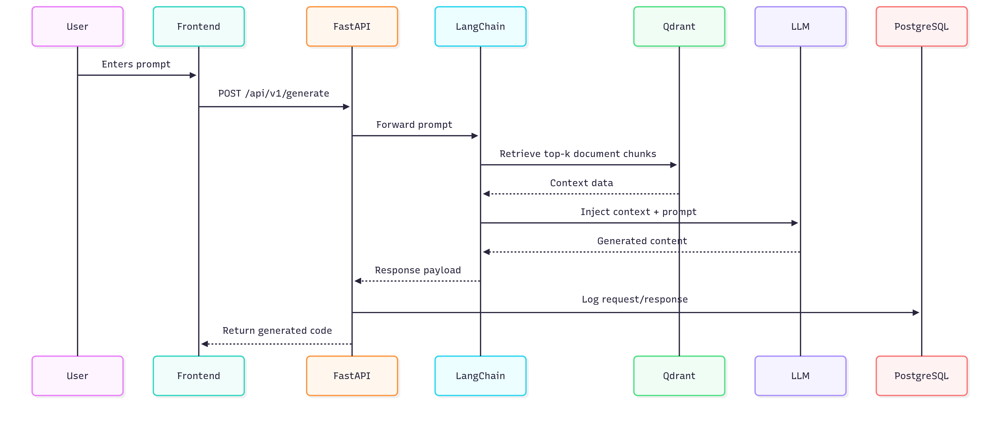
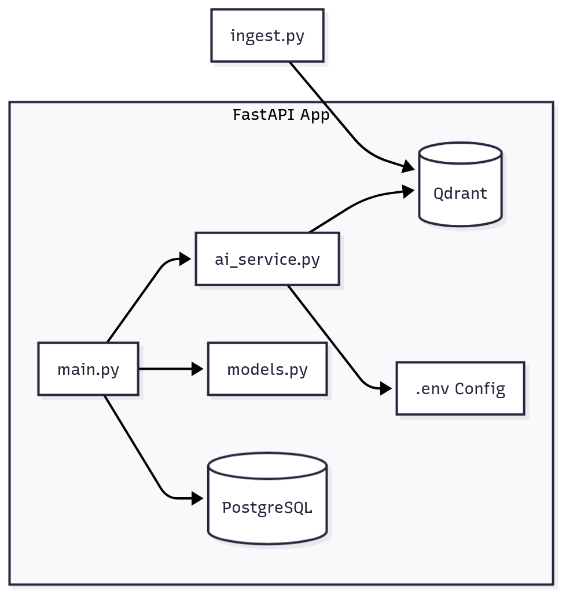
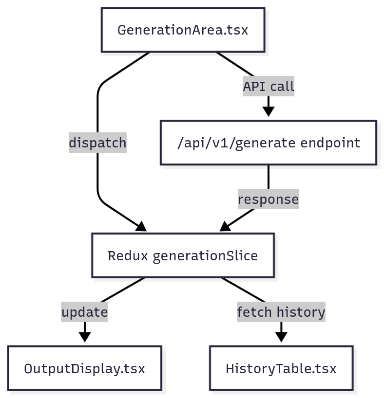
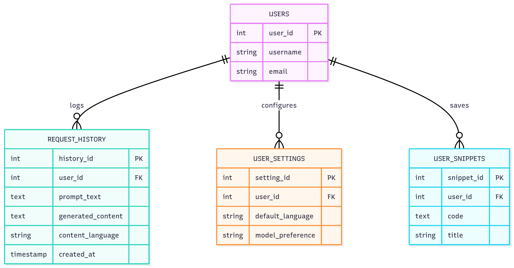

# 📘 Technical Design — Smart Developer Assistant (SDA)

## 1. Introduction
This document outlines the architecture and implementation of the **Smart Developer Assistant** after completing **Phase 2 (RAG & Docs Q&A Integration)**.  
The goal is to enable context-aware generation through document retrieval, hybrid ranking, and source traceability.

---

## 2. Architectural Overview
SDA follows a **modular microservice architecture**, separating:
- FastAPI (backend API)
- PostgreSQL (structured storage)
- Qdrant (vector embeddings)
- React + Redux (frontend)

### 🏗️ System Architecture


**Phase 2 Enhancements**
- Added RAG retrieval flow via Qdrant.  
- Introduced secure document ingestion (`/upload_docs`).  
- Added frontend mode toggle (Code ↔ Docs Q&A).

---

## 3. RAG Data Flow


1️⃣ Frontend submits prompt → FastAPI (`main.py`)  
2️⃣ Retriever in `ai_service.py` queries Qdrant collection `sda_dev_documentation`  
3️⃣ Context chunks + `SYSTEM_PROMPT` → LLM (OpenAI API)  
4️⃣ LLM generates answer with context  
5️⃣ Sources + scores returned to frontend  
6️⃣ Request/response logged in PostgreSQL

---

## 4. Backend Implementation


### Modules
| Module | Responsibility |
|---------|----------------|
| **main.py** | FastAPI routes, CORS, DB logging, secure upload endpoint |
| **ai_service.py** | Full LangChain RAG logic + hybrid re-ranking (BM25 + fuzzy) |
| **models.py** | Pydantic schemas (`DocQARequest`, `GenerationResponse.sources`) |
| **ingest.py** | CLI + programmatic Qdrant ingestion with embeddings |

**Phase 2 Additions**
- `answer_from_docs()` endpoint  
- `upsert_documents()` function for on-demand ingestion  
- Hybrid retriever with dense + lexical signals  
- Metadata filters for source/doctype

---

## 5. Frontend Design & Interaction


**Core Components**
| Component | Purpose |
|------------|----------|
| `ModeToggle.tsx` | Switch between Code and Docs Q&A modes |
| `GenerationArea.tsx` | Main input form for prompt submission |
| `OutputDisplay.tsx` | Shows AI output and sources |
| `SourcesList.tsx` | Lists retrieved chunks with scores/snippets |
| `generationSlice.ts` | Redux state for prompt, mode, filters, and responses |

**Phase 2 Enhancements**
- Redux thunks for `/generate` and `/answer_from_docs`  
- Mode-specific parameters (top_k, rerank)  
- UI updates for real-time source display  

---

## 6. Database Design


| Entity | Description |
|---------|-------------|
| `request_history` | Stores all user requests and responses |
| `users` | (Future) Authentication records |
| `user_settings` | (Phase 3+) Preferences and model options |
| `user_snippets` | (Phase 3+) Saved code snippets |

Qdrant collection `"sda_dev_documentation"` stores embeddings with metadata:

```json
{
  "text": "document chunk text",
  "source": "api_service.txt",
  "chunk_id": 3,
  "doctype": "txt"
}
