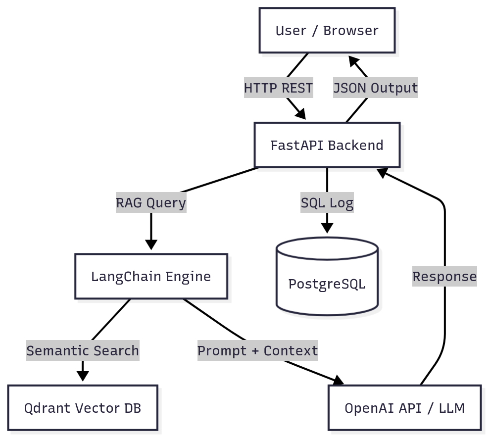

# 📘 Technical Design — Smart Developer Assistant (SDA)

## 1. Introduction

This document details the **architectural decisions** and **implementation specifics** for the Smart Developer Assistant (SDA) project, currently stable after completing **Phase 2 (Intelligence Integration)**.

**Goal:** Establish a full-stack RAG system demonstrating efficient data retrieval and context-aware LLM prompting.

---

## 2. Architectural Overview

The SDA uses a **Microservice-Oriented Architecture**, separating the API layer (FastAPI) from the persistence layers (PostgreSQL and Qdrant).

### 🏗️ High-Level System Architecture

The following diagram shows how the frontend, backend, databases, and AI model interact:

---

### 🔄 RAG Data Flow Sequence

This diagram illustrates the sequential flow of information through the RAG pipeline — from user prompt submission to response generation and logging.

**Workflow:**  
1. **Request:** React frontend sends `prompt_text` to FastAPI.  
2. **Retrieval:** `ai_service.py` queries Qdrant via LangChain Retriever.  
3. **Context Injection:** Retrieved document chunks and `SYSTEM_PROMPT` are combined into a final payload.  
4. **Generation:** The OpenAI LLM generates a context-aware response.  
5. **Audit:** The response is logged into PostgreSQL.  
6. **Response:** JSON output is returned to the frontend UI.

---

## 3. Backend Implementation Details

### 🧩 Backend Component Architecture

The backend is modularly designed with FastAPI serving as the API layer, LangChain handling LLM orchestration, and Qdrant/PostgreSQL as the data stores.

**Modules:**  
- `main.py`: FastAPI routes and database connectivity  
- `ai_service.py`: Core RAG logic and LangChain orchestration  
- `models.py`: Pydantic schema definitions  
- `ingest.py`: Handles RAG document ingestion and embedding creation  

---

## 4. Frontend Design & API Interaction

The frontend, built with React and Redux, manages global state and user interactions while communicating asynchronously with the FastAPI backend.

**Components Overview:**  
- `GenerationArea.tsx`: Accepts user prompts and triggers API requests.  
- `OutputDisplay.tsx`: Displays generated AI responses.  
- `HistoryTable.tsx`: Shows previous interactions using MUI DataGrid.  
- `generationSlice.ts`: Centralized Redux state management.  

---

## 5. Database Schema

The database stores structured user data, request logs, and configurations in PostgreSQL, while Qdrant handles vectorized document embeddings.

**Entities:**  
- `users`: Stores user accounts and credentials.  
- `request_history`: Logs user prompts, responses, timestamps.  
- `user_settings`: Holds user preferences (model, language, etc.).  
- `user_snippets`: Stores saved code snippets.  

---

## 6. Key Implementation Notes

- **Environment Configuration:** `.env` file is loaded early using `load_dotenv()` to ensure all credentials are set.  
- **Embedding Model:** Uses `all-MiniLM-L6-v2` for balanced performance and accuracy.  
- **LangChain Expression Language (LCEL):** Used to efficiently chain the retriever and LLM.  
- **CORS Setup:** Configured in FastAPI to allow frontend access from `http://localhost:5173`.  

---

## 7. Roadmap

- **v1.0.0 Release:** Tag Phase 2 as stable.  
- **Phase 3:** Add user authentication & code refactoring endpoint.  
- **Phase 4:** Implement file upload + codebase indexing in Qdrant for deep project analysis.  

---

**📎 Note:**  
All architecture diagrams are stored in the `/images` directory (relative to the project root) and referenced with relative paths.  
Ensure that this folder is committed to your Git repository for proper rendering on GitHub or any Markdown viewer.