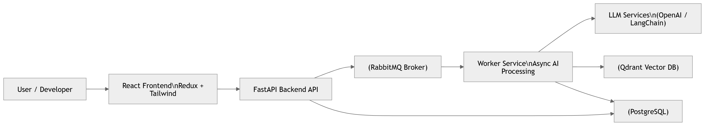
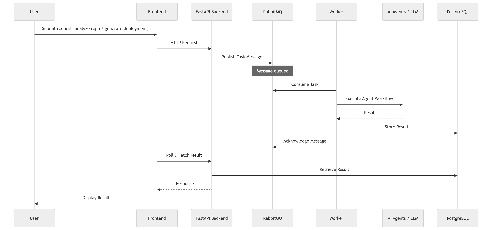
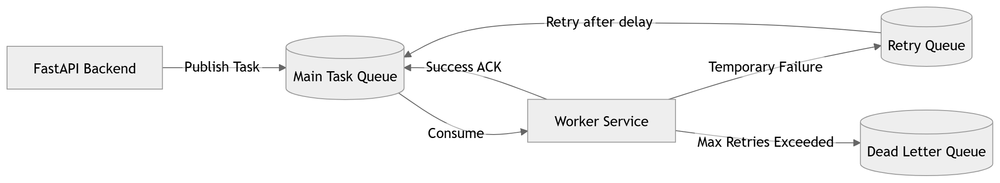
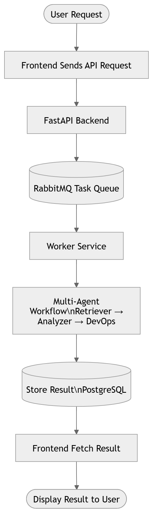
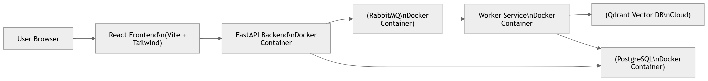

# Smart Developer Assistant (SDA)

# Technical Design Document

## Phase 8 -- Multi‑Agent Architecture

## Phase 9 -- Asynchronous Task Execution

------------------------------------------------------------------------

# 1. Introduction

The Smart Developer Assistant (SDA) is a full‑stack Generative AI
platform designed to help developers analyze repositories, refactor
code, generate deployment artifacts, and interact with AI agents through
a modern web interface.

Earlier phases implemented:

-   Code generation and refactoring
-   Retrieval Augmented Generation (RAG)
-   Project ingestion and analysis
-   GitHub integration
-   Multi‑agent workflows

Phase 8 and Phase 9 introduce major architectural improvements:

**Phase 8 -- Multi‑Agent Architecture** A modular AI agent system
capable of coordinating multiple specialized agents.

**Phase 9 -- Asynchronous Task Execution** A distributed task processing
architecture using RabbitMQ, worker services, retry queues, and dead
letter queues.

------------------------------------------------------------------------

# 2. Current Architecture Overview

The SDA system is implemented as a distributed cloud‑ready architecture
composed of multiple services.

## Core Technology Stack

Frontend - React - Redux - Tailwind CSS - Vite

Backend API - FastAPI (Python) - LangChain - OpenAI / LLM

Messaging - RabbitMQ (Docker)

Worker Service - Python background workers

Databases - PostgreSQL (metadata & history) - Qdrant (vector database)

Infrastructure - Docker containers - Cloud‑ready microservice
architecture

------------------------------------------------------------------------

# 3. High Level System Architecture

Components:

Frontend (React) ↓ FastAPI Backend ↓ RabbitMQ Message Broker ↓ Worker
Service ↓ LLM / AI Processing ↓ Databases (PostgreSQL + Qdrant)

The backend API handles user requests while long‑running AI tasks are
delegated to worker services through RabbitMQ queues.

------------------------------------------------------------------------

# 4. Phase 8 -- Multi‑Agent Architecture

Phase 8 introduces an agent‑based AI orchestration system that allows
SDA to solve complex developer tasks by coordinating multiple
specialized agents.

## Agent Types

### Retriever Agent

Responsibilities

-   Retrieves relevant code and documentation from Qdrant
-   Provides contextual information for reasoning agents

Tools

-   Vector search
-   Document retrieval

------------------------------------------------------------------------

### Analyzer Agent

Responsibilities

-   Generates architecture summaries
-   Identifies dependencies and entry points
-   Produces system level explanations

------------------------------------------------------------------------

### Refactor Agent

Responsibilities

-   Reviews source code
-   Suggests improvements
-   Generates optimized code

------------------------------------------------------------------------

### DevOps Agent

Responsibilities

-   Generates deployment artifacts
-   Creates Dockerfiles
-   Creates Kubernetes manifests
-   Generates CI/CD pipelines

------------------------------------------------------------------------

### Coordinator / Agent Manager

The Agent Manager orchestrates execution.

Responsibilities

-   Selects which agents should run
-   Coordinates multi‑step reasoning
-   Aggregates final response

------------------------------------------------------------------------

# 5. Agent Execution Flow

Example: Repository Deployment Request

User Request ↓ Agent Manager ↓ Retriever Agent (collect repo context) ↓
Analyzer Agent (architecture summary) ↓ DevOps Agent (generate
deployment artifacts) ↓ Final Result Returned

------------------------------------------------------------------------

# 6. Phase 9 -- Asynchronous Task Execution

AI tasks such as:

-   repository analysis
-   deployment generation
-   large code reviews

can take several seconds or minutes.

To support scalability and reliability, Phase 9 introduces
**asynchronous task processing using RabbitMQ**.

------------------------------------------------------------------------

# 7. RabbitMQ Messaging Architecture

Queues:

Main Task Queue Retry Queue Dead Letter Queue (DLQ)

### Main Queue

Receives tasks from the FastAPI backend.

Examples

-   analyze_repository
-   generate_deployment
-   refactor_code

------------------------------------------------------------------------

### Retry Queue

Handles transient failures.

If a worker fails processing a task:

1.  Message is moved to Retry Queue
2.  Delay applied
3.  Message re‑queued to main queue

------------------------------------------------------------------------

### Dead Letter Queue (DLQ)

If a task fails repeatedly after max retries:

-   Message moved to DLQ
-   Stored for inspection
-   Allows debugging without losing task data

------------------------------------------------------------------------

# 8. Worker Service Design

Worker services consume messages from RabbitMQ queues and execute AI
tasks.

Responsibilities

-   Execute agent workflows
-   Call LLM services
-   Query Qdrant
-   Store results

Worker Steps

1.  Consume message from queue
2.  Deserialize task payload
3.  Execute agent workflow
4.  Store result
5.  Acknowledge message

------------------------------------------------------------------------

# 9. Task Lifecycle

1.  User submits request
2.  Backend publishes message to RabbitMQ
3.  Worker consumes task
4.  Agents execute workflow
5.  Result stored in database
6.  Frontend retrieves result

------------------------------------------------------------------------

# 10. System Scalability

The architecture supports horizontal scaling.

Scaling options

API Servers - Multiple FastAPI containers

Workers - Multiple worker instances

RabbitMQ - High availability cluster

Vector Database - Qdrant distributed cluster

Database - PostgreSQL managed service

------------------------------------------------------------------------

# 11. Deployment Architecture

Docker containers:

Frontend Container Backend API Container RabbitMQ Container Worker
Container PostgreSQL Container Qdrant Cloud

------------------------------------------------------------------------

# 12. Benefits of Phase 8 + 9 Architecture

Key advantages

Scalable - workers scale independently

Fault tolerant - retry queues handle transient failures

Observable - DLQ enables debugging

Modular - agent architecture allows new AI capabilities

Cloud ready - containerized microservices

------------------------------------------------------------------------

# 13. Future Enhancements

Planned improvements

-   distributed worker autoscaling
-   streaming task status updates
-   agent memory systems
-   Kubernetes deployment

------------------------------------------------------------------------

End of Phase 8‑9 Technical Design
