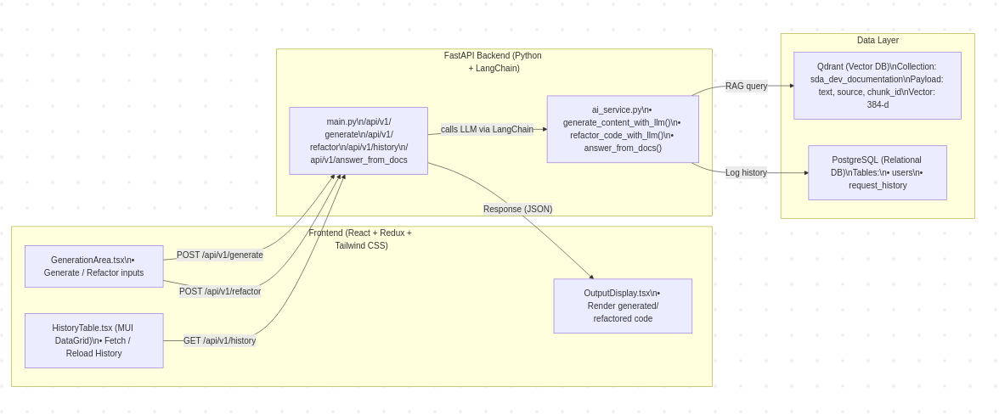
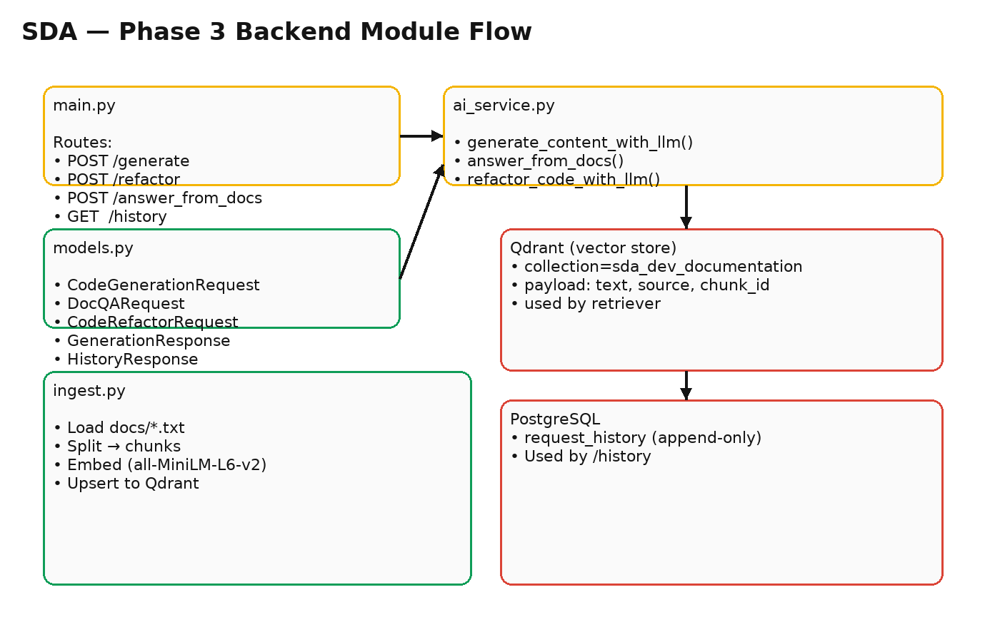
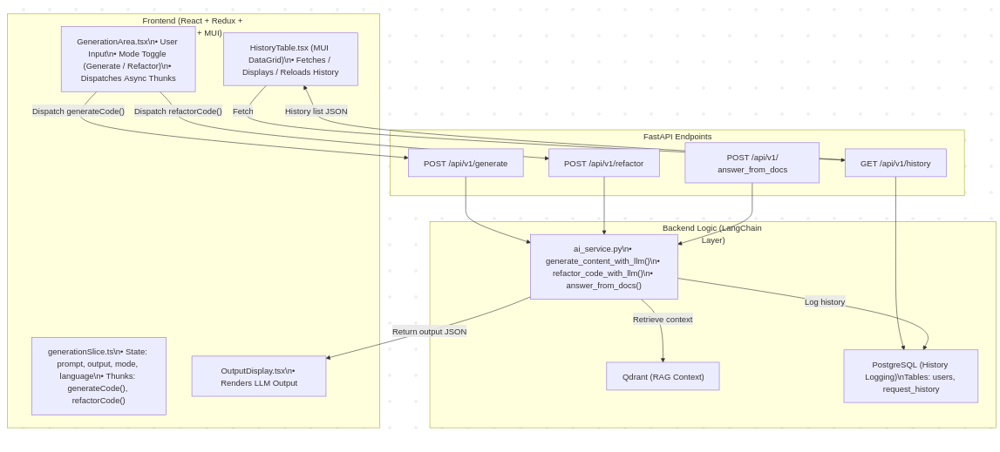
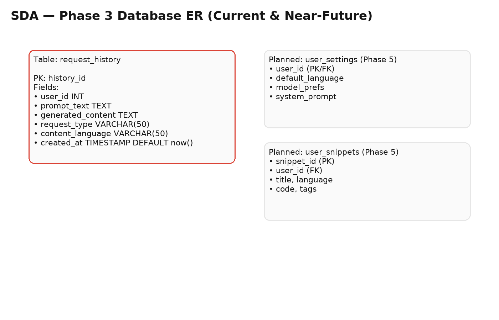
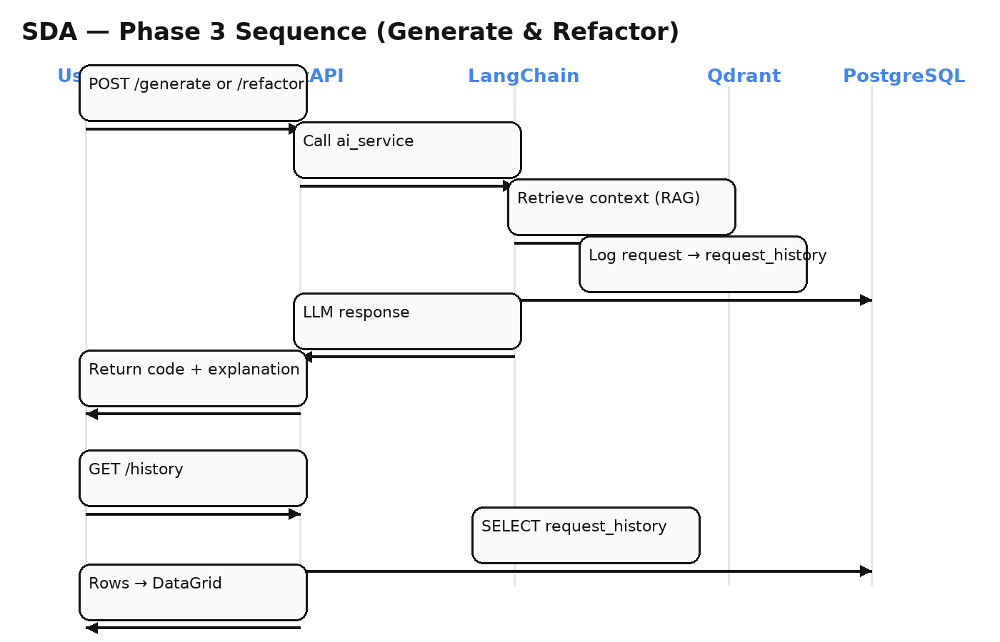
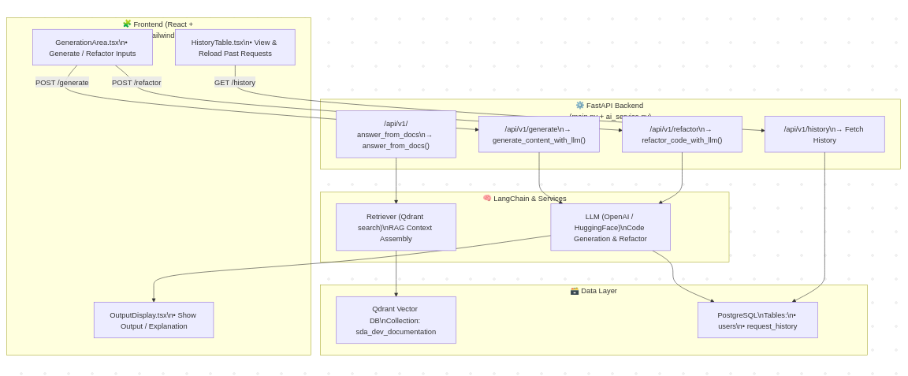

# 📘 Technical Design — Smart Developer Assistant (SDA) — Phase 3

This Phase 3 update adds **Refactor (AI Code Review)** and a **History UI** on top of the Phase 2 RAG foundation.

## 1. Architecture Overview

**Key updates:**  
- New endpoint: **`POST /api/v1/refactor`** → `ai_service.refactor_code_with_llm()`  
- **MUI DataGrid History**: `GET /api/v1/history` (click to reload)  
- Continued **RAG** via Qdrant for context retrieval and **PostgreSQL** for structured history logging

## 2. Backend Module Flow

**Highlights**
- `main.py` exposes: `/generate`, `/refactor`, `/answer_from_docs`, `/history`
- `ai_service.py` implements:
  - `generate_content_with_llm()`
  - `answer_from_docs()`
  - `refactor_code_with_llm()`
- `ingest.py`: Splits, embeds, and upserts docs to Qdrant

## 3. Frontend–API Flow

**Components**
- `GenerationArea.tsx`: toggle Generate/Refactor, dispatch async thunks
- `OutputDisplay.tsx`: render generated or refactored output
- `HistoryTable.tsx`: DataGrid listing (click row → reload into editor)

**Redux slice**
- `generationSlice.ts`: state → `prompt`, `output`, `mode`, `language`
- Thunks: `generateCode()`, `refactorCode()`

## 4. Database ER (Current & Near-Future)

**Current**
- `request_history` (append-only)
  - `history_id`, `user_id`, `prompt_text`, `generated_content`, `request_type`, `content_language`, `created_at`

**Planned (Phase 5)**
- `user_settings` (preferences)
- `user_snippets` (saved code)

## 5. Sequence Flows

- **Generate** → LLM + (optional) RAG context → DB log → UI render
- **Refactor** → AI code review/refactor + explanation → DB log → UI render
- **History** → Select rows → reload prompt/output

## 6. One-Page Summary

---

### Implementation Notes
- Frontend `.env`: `VITE_API_BASE_URL=http://127.0.0.1:8000`  
- Backend `.env`: `OPENAI_API_KEY`, `QDRANT_URL`, `QDRANT_API_KEY`, DB creds
- Deprecation warnings (LangChain): optional migration to `langchain-huggingface` and `langchain-qdrant`

